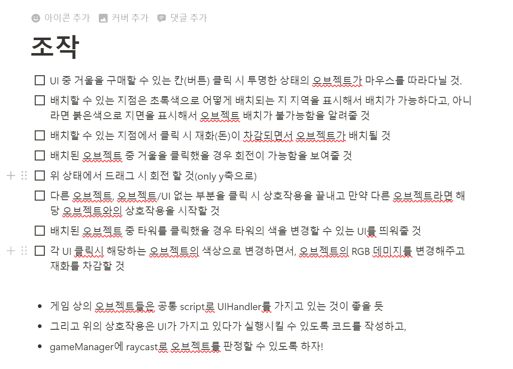

# 1/9 활동
## 컨트롤적인 부분에서 어떻게 작동하여야 하는 지 고민하며 내역서를 작성해봤습니다.
## 기본적인 컨트롤 플로우와, 게임에서 플레이어가 어떠한 상호작용이 가능한지 고민을 했고, 오브젝트에 어떠한 컴포넌트가 들어가야 하고, 최대한 공통적으로 이용할 수 있는 부분이 무엇일 지 객체지향적으로 많은 고민을 할 수 있었던 것 같습니다.
## 어떠한 방향으로 개발을 해야하는지 고민할 수 있었던 값진 시간이였던 것 같습니다.
